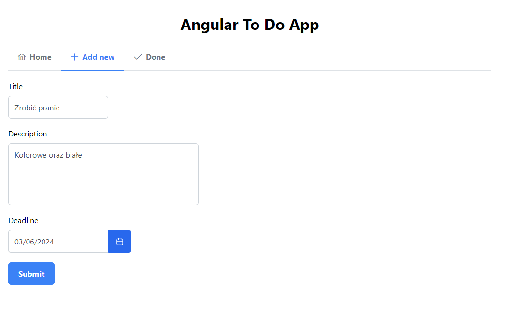

# Aplikacja do zarządzania zadaniami

## Opis

Aplikacja do zarządzania zadaniami to narzędzie stworzone w oparciu o framework Angular, które umożliwia użytkownikom skuteczne planowanie, śledzenie i zarządzanie swoimi zadaniami w sposób efektywny.

## Funkcje

- **Dodawanie zadań:** Użytkownicy mogą dodawać nowe zadania, określając ich tytuł, opis, termin wykonania itp.
- **Przeglądanie zadań:** Interfejs umożliwia łatwe przeglądanie istniejących zadań w formie listy.
- **Edycja i usuwanie zadań:** Użytkownicy mogą edytować istniejące zadania, zmieniając ich szczegóły lub usuwając je z listy.
- **Oznaczanie zadań jako zakończone:** Istnieje opcja oznaczania zadań jako zakończone, co pomaga użytkownikom śledzić postęp i osiągnięcia.

## Technologie

Aplikacja do zarządzania zadaniami została zbudowana w oparciu o następujące technologie:

- Angular: Framework JavaScript do budowania aplikacji internetowych.
- TypeScript: Rozszerzenie języka JavaScript o statyczną typizację.
- HTML/CSS: Języki do tworzenia struktury i stylizacji interfejsu użytkownika.
- RxJS: Biblioteka reaktywnego programowania do obsługi asynchronicznych operacji.
- Angular Component Store: Mechanizm do zarządzania stanem komponentów w aplikacji Angular.
- CRUD: Wykorzystanie API ze strony https://crudcrud.com/ do przechowywania danych aplikacji.

## Zrzuty ekranu

## Instalacja

Aby zainstalować aplikację lokalnie, wykonaj następujące kroki:

1. Sklonuj repozytorium z kodem aplikacji.
2. Przejdź do katalogu głównego aplikacji w terminalu.
3. Wykonaj polecenie `npm install` w celu zainstalowania zależności.
4. Uruchom aplikację za pomocą polecenia `ng serve`.
5. Otwórz przeglądarkę internetową i przejdź pod adres `http://localhost:4200/`, aby korzystać z aplikacji.
